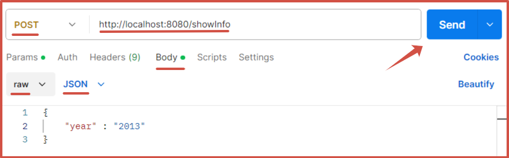
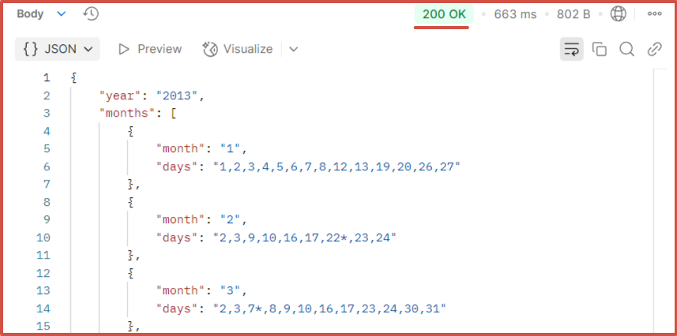
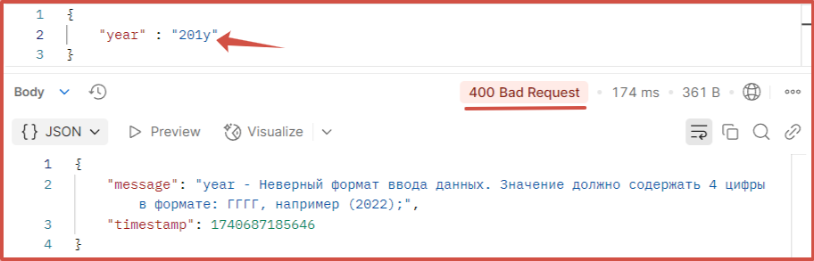
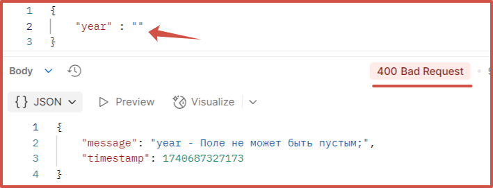
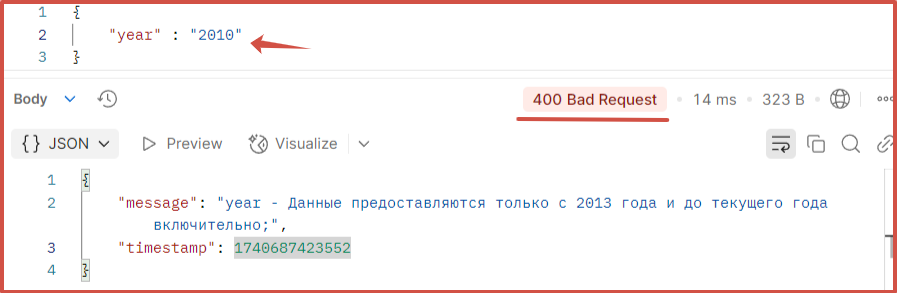
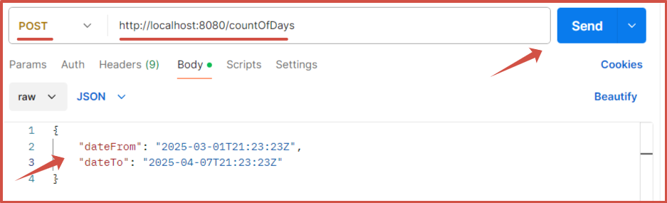
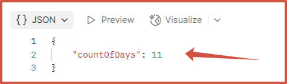
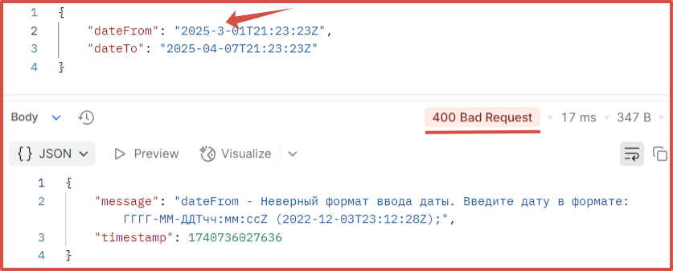
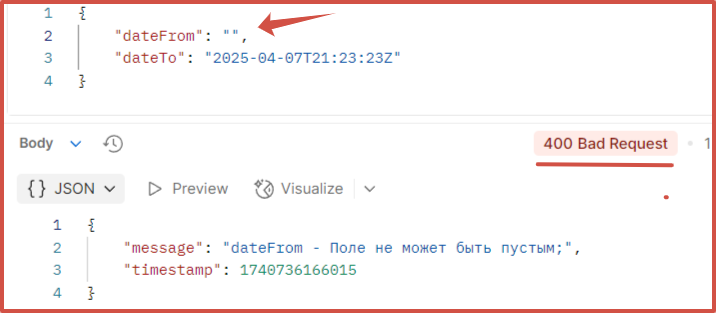
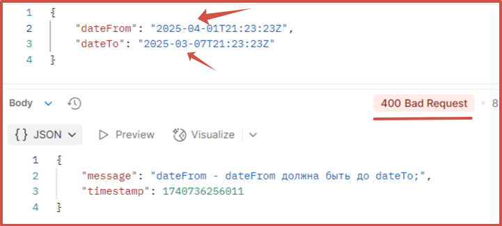

# $${\color{blue}Данные \space \color{blue} по \space \color{blue} выходным \space \color{blue} дням \space \color{blue}за \space \color{blue} календарный \space \color{blue} год.}$$

<h1 align="center">Описание проекта.</h1>

<b>Данное приложение позволяет:</b>
- выводить данные по выходным дням за календарный год;
- определять сколько выходных дней за указанный период;
- возвращать дату, которая наступит по истечении такого числа рабочих дней,которое было передано в качестве параметра
 

<b>Важно:</b> Перед запуском приложения убедитесь, что на вашем компьютере уже предустановлены
- Docker
- сборщик Maven
- Postman (для проверки работоспособности)

<b>Для запуска приложения необходимо:</b>
1. Скопировать проект с удаленного репозитория GitHub к себе на локальный компьютер.
2. Перейти в терминале командной строки в корневую папку проекта.
3. Выполнить команды:
    - <b><i>mvn clean package</i></b> (собираем проект в исполняемый jar-файл)

    - <b><i>docker-compose up -d</i></b> (запускаем контейнер с приложением)
       

<h3 align="center">Ограничения на входные данные и формат ввода.</h3>
 

1. Запускаем приложение Postman.
2. Для получения данных по выходным дням за календарный год в строке ендпоинта нашего API вводим адрес: <b>http://localhost:8080/showInfo</b>
3. В типе запроса выбираем <b>"POST"</b>
4. Устанавливаем переключатель на <b>"Body" -> "row"</b> и выбираем формат передачи данных как <b>"JSON"</b>
5. Вводим наши данные в формате "ключ - значение". Здесь мы должны указать год, за который хотим получить данные
6. Ключом является параметр <b>"year"</b> - указывается в кавычках.
7. Через двоеточие для него задаем значение (также указывается в кавычках) в формате <b>(ГГГГ)</b> - указываем четыре цифры.
8. Отправляем запрос на выполнение с помощью кнопки <b>"Send"</b>. (Смотри рисунок ниже)

<h2 align="center">
  
</h2>

После успешной отправки запроса мы получим ответ также в формате <b>"ключ - значение"</b>, 
где будет указана информация по выходным дням за весь год. (Смотри рисунок ниже).

<h2 align="center">
  
</h2>

В случае некорректного ввода данных предусмотрены ошибки:
- неверный формат:

<h2 align="center">
  
</h2>

- пустое поле для значения года:

<h2 align="center">
  
</h2>

- год, данных о котором нет в сервисе. На данный момент приложение позволяет запрашивать информацию с 2013г и по текущий год включительно:

<h2 align="center">
  
</h2>

9. Для определения количества выходных за указанный период в строке ендпоинта нашего API вводим адрес: <b>http://localhost:8080/countOfDays</b>
Формат ввода данных аналогичен работе с предыдущим пунктом (получение данных за календарный год).
Вводим наши данные в формате "ключ - значение". Здесь мы должны указать диапазон дат в формате <b>ISO 8601</b>
Ключами являются параметры <b>"dateFrom"</b> - нижняя граница диапазона и <b>"dateTo"</b> - верхняя граница диапазона.
Через двоеточие для каждого параметра задаем дату (также указывается в кавычках) <b>"БЕЗ ПРОБЕЛОВ"</b> в формате <b>"гггг-ММ-ддТчч:мм:ссZ"</b>, где:
   - <b>гггг</b> - год,
   - <b>ММ</b> - месяц,
   - <b>чч</b> - число,
   - <b>Т</b> - специальный символ (оставляем без изменения),
   - <b>чч</b> - часы,
   - <b>мм</b> - минуты,
   - <b>сс</b> - секунды,
   - <b>Z</b> - специальный символ (оставляем без изменения)
Отправляем запрос на выполнение с помощью кнопки <b>"Send"</b>. (Смотри рисунок ниже)

<h2 align="center">
  
</h2>

После успешной отправки запроса мы получим ответ также в формате <b>"ключ - значение"</b>,
где будет указано количество выходных дней за выбранный период. (Смотри рисунок ниже).

<h2 align="center">
  
</h2>

В случае некорректного ввода данных предусмотрены ошибки:
- неверный формат:

<h2 align="center">
  
</h2>

- пустое поле для значения даты:

<h2 align="center">
  
</h2>

- нижняя граница даты больше, чем верхняя граница:

<h2 align="center">
  
</h2>

